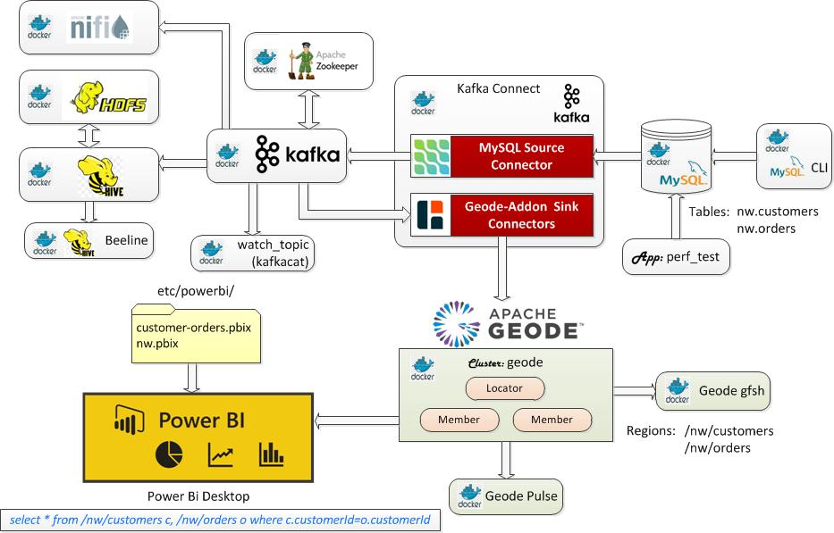
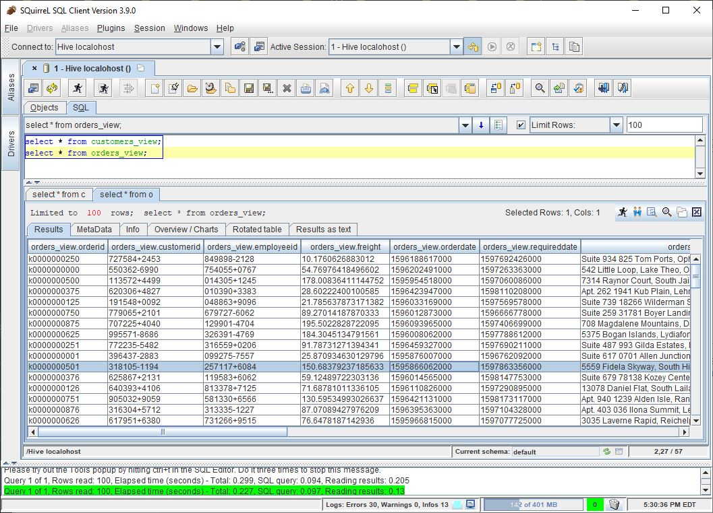

# Debezium-Hive-Kafka Geode Connector

This bundle integrates Geode with Debezium and Apache Hive for ingesting initial data and CDC records from MySQL into a Geode cluster via a Kafka sink connector included in the `padogrid` distribution. It supports inserts, updates and deletes.

## Installing Bundle

```console
install_bundle -download bundle-geode-1-docker-debezium_hive_kafka
```

:exclamation: If you are running this demo on WSL, make sure your workspace is on a shared folder. The Docker volume it creates will not be visible otherwise.

## Use Case

This use case ingests data changes made in the MySQL database into a Geode cluster via Kafka connectors and also integrates Apache Hive for querying Kafka topics as external tables and views. It extends [the original Debezium-Kafka bundle](https://github.com/padogrid/bundle-geode-1-docker-debezium_kafka) with Docker compose, Apache Hive, and  the North Wind mock data for `customers` and `orders` tables. It includes the MySQL source connector and the `geode-addon` Debezium sink connectors.



## Required Software

- Docker
- Docker Compose
- Maven
- PadoGrid 0.9.5-SNAPSTHOT+ (02/10/2021)

## Optional Software

- jq

## Building Demo

We must first build the demo by running the `build_app` command as shown below. This command copies the Geode and `geode-addon-core` jar files to the Docker container mounted volume in the `padogrid` directory so that the Geode Debezium Kafka connector can include them in its class path. It also downloads the Hive JDBC driver jar and its dependencies in the `padogrid/lib/jdbc` directory.

```console
cd_docker debezium_hive_kafka; cd bin_sh
./build_app
```

Upon successful build, the `padogrid` directory should have jar files similar to the following:

```console
cd_docker debezium_hive_kafka
tree padogrid
```

```console
padogrid
├── etc
│   └── client-cache.xml
├── lib
│   ├── geode-addon-common-0.9.3-SNAPSHOT.jar
│   ├── geode-addon-core-4-0.9.3-SNAPSHOT.jar
│   ├── geode-enterprise-all-4.0.1.jar
│   └── jdbc
│       ├── commons-logging-1.2.jar
│       ├── curator-client-2.12.0.jar
│       ├── guava-19.0.jar
│       ├── hadoop-common-2.6.0.jar
│       ├── hive-common-3.1.2.jar
│       ├── hive-jdbc-3.1.2.jar
│       ├── hive-metastore-3.1.2.jar
│       ├── hive-serde-3.1.2.jar
│       ├── hive-service-3.1.2.jar
│       ├── hive-service-rpc-3.1.2.jar
│       ├── httpclient-4.5.2.jar
│       ├── httpcore-4.4.4.jar
│       ├── libthrift-0.9.3.jar
│       └── slf4j-api-1.7.10.jar
├── log
└── plugins
    └── geode-addon-core-4-0.9.3-SNAPSHOT-tests.jar
```


## Creating Geode Docker Containers

Let's create a Geode cluster to run on Docker containers as follows.

```console
create_docker -cluster geode -host host.docker.internal
cd_docker geode
```

If you are running Docker Desktop, then the host name, `host.docker.internal`, is accessible from the containers as well as the host machine. You can run the `ping` command to check the host name.

```console
ping host.docker.internal
```

If `host.docker.internal` is not defined then you will need to use the host IP address that can be accessed from both the Docker containers and the host machine. Run `create_docker -?` or `man create_docker` to see the usage.

```console
create_docker -?
```

If you are using a host IP other than `host.docker.internal` then you must also make the change in the Debezium Geode connector configuration file as follows.

```console
cd_docker debezium_hive_kafka
vi padogrid/etc/client-cache.xml
```

Replace `host.docker.internal` in `client-cache.xml` with your host IP address.

```xml
<client-cache ...>
   ...
    <pool name="serverPool">
         <locator host="host.docker.internal" port="10334" />
    </pool>
   ...
</client-cache>
```

If you will be running the Desktop app then you also need to register the `org.geode.demo.nw.data.PortableFactoryImpl` class in the Geode cluster. The `Customer` and `Order` classes implement the `VersionedPortable` interface.

```bash
cd_docker geode
vi padogrid/etc/geode.xml
```

Add the following in the `geode.xml` file.

```xml
                        <portable-factory factory-id="1">
                        org.geode.demo.nw.data.PortableFactoryImpl
                        </portable-factory>
```

## Creating `perf_test` app

Create and build `perf_test` for ingesting mock data into MySQL:

```bash
create_app -app perf_test -name perf_test_hive
cd_app perf_test_hive; cd bin_sh
./build_app
```

Set the MySQL user name and password for `perf_test_hive`:

```bash
cd_app perf_test_hive
vi etc/hibernate.cfg-mysql.xml
```

Set user name and password as follows:

```xml
                <property name="connection.username">debezium</property>
                <property name="connection.password">dbz</property>
```

## Starting Docker Containers

### 1. Start Geode

```bash
cd_docker geode
docker-compose up
```

### 2. Start Debezium

Start Zookeeper, Kafka, MySQL, Kafka Connect, Apache Hive containers:

```bash
cd_docker debezium_hive_kafka
docker-compose up
```

:exclamation: Wait till all the containers are up before executing the `init_all` script.

Execute `init_all` which performs the following:

- Create the `nw` database and grant all privileges to the user `debezium`:
- Copy the Kafka handler jar file to HDFS. It is required for executing queries with joins.

```bash
cd_docker debezium_hive_kafka; cd bin_sh
./init_all
```

There are three (3) Kafka connectors that we need to register. The MySQL connector is provided by Debezium and the data connectors are part of the PadoGrid distribution. 

```bash
cd_docker debezium_hive_kafka; cd bin_sh
./register_connector_mysql
./register_connector_data_customers
./register_connector_data_orders
```

### 3. Ingest mock data into the `nw.customers` and `nw.orders` tables in MySQL

```bash
cd_app perf_test_hive; cd bin_sh
./test_group -run -db -prop ../etc/group-factory.properties
```

### 4. Run Hive Beeline CLI

```
cd_docker debezium_hive_kafka; cd bin_sh
./run_beeline
```

Create and query `customers_payload` external table

```sql
-- Create customers external table
drop table if exists customers_payload;
CREATE EXTERNAL TABLE customers_payload
(payload string)
STORED BY 'org.apache.hadoop.hive.kafka.KafkaStorageHandler'
TBLPROPERTIES
("kafka.topic" = "customers",
"kafka.bootstrap.servers"="kafka:9092"
 );

-- Query customers_payload external table
select * from customers_payload;
```

**Output:**

```console
+----------------------------+----------------------------------------------------+--------------------------------+-----------------------------+--------------------------------+
| customers_payload.payload  |              customers_payload.__key               | customers_payload.__partition  | customers_payload.__offset  | customers_payload.__timestamp  |
+----------------------------+----------------------------------------------------+--------------------------------+-----------------------------+--------------------------------+
| {                          | {"schema":{"type":"struct","fields":[{"type":"string","optional":false,"field":"customerId"}],"optional":false,"name":"dbserver1.nw.customers.Key"},"payload":{"customerId":"k0000000612"}} | 0                              | 2900                        | 1596469641340                  |
| {                          | {"schema":{"type":"struct","fields":[{"type":"string","optional":false,"field":"customerId"}],"optional":false,"name":"dbserver1.nw.customers.Key"},"payload":{"customerId":"k0000000862"}} | 0                              | 2901                        | 1596469641340                  |
| {                          | {"schema":{"type":"struct","fields":[{"type":"string","optional":false,"field":"customerId"}],"optional":false,"name":"dbserver1.nw.customers.Key"},"payload":{"customerId":"k0000000987"}} | 0                              | 2902                        | 1596469641341                  |
| {                          | {"schema":{"type":"struct","fields":[{"type":"string","optional":false,"field":"customerId"}],"optional":false,"name":"dbserver1.nw.customers.Key"},"payload":{"customerId":"k0000000238"}} | 0                              | 2903                        | 1596469641341                  |
| {                          | {"schema":{"type":"struct","fields":[{"type":"string","optional":false,"field":"customerId"}],"optional":false,"name":"dbserver1.nw.customers.Key"},"payload":{"customerId":"k0000000113"}} | 0                              | 2904                        | 1596469641341                  |
| {                          | {"schema":{"type":"struct","fields":[{"type":"string","optional":false,"field":"customerId"}],"optional":false,"name":"dbserver1.nw.customers.Key"},"payload":{"customerId":"k0000000488"}} | 0                              | 2905                        | 1596469641341                  |
| {                          | {"schema":{"type":"struct","fields":[{"type":"string","optional":false,"field":"customerId"}],"optional":false,"name":"dbserver1.nw.customers.Key"},"payload":{"customerId":"k0000000363"}} | 0                              | 2906                        | 1596469641341                  |
...
```

Create and query `customers` external table


```sql
-- Create customers external table
drop table if exists customers;
CREATE EXTERNAL TABLE customers
(payload struct <after:struct<customerid:string,address:string,city:string,companyname:string,contactname:string,contacttitle:string,country:string,fax:string,phone:string,postalcode:string,region:string>>)
STORED BY 'org.apache.hadoop.hive.kafka.KafkaStorageHandler'
TBLPROPERTIES
("kafka.topic" = "customers",
"kafka.bootstrap.servers"="kafka:9092"
 );

-- Query customers external table
select payload.after.customerid,payload.after.address,payload.after.city,payload.after.companyname,payload.after.contactname,payload.after.contacttitle,payload.after.country,payload.after.fax,payload.after.phone,payload.after.postalCode,payload.after.region,`__partition`,`__timestamp` from customers;

-- Query data consumed within the past 10 minutes
select payload.after.customerId,payload.after.address,payload.after.city,payload.after.companyName,payload.after.contactName,payload.after.contactTitle,payload.after.country,payload.after.fax,payload.after.phone,payload.after.postalCode,payload.after.region,`__partition`,`__timestamp` from customers
where `__timestamp` >  1000 * to_unix_timestamp(CURRENT_TIMESTAMP - interval '10' MINUTES);
```

**Output:**

```console
+--------------+----------------------------------------------------+------------------------+---------------------------------------+----------------+---------------------------------------------+----------------------------------------------------+-----------------+------------------------+-------------+---------+--------------+----------------+
|  customerid  |                      address                       |          city          |              companyname              |  contactname   |                contacttitle                 |                      country                       |       fax       |         phone          | postalcode  | region  | __partition  |  __timestamp   |
+--------------+----------------------------------------------------+------------------------+---------------------------------------+----------------+---------------------------------------------+----------------------------------------------------+-----------------+------------------------+-------------+---------+--------------+----------------+
| k0000000612  | 50622 Boyer Rapids, Simonisberg, TN 62253          | Dickinsonhaven         | Pollich, Walker and Reichel          | Gibson         | Principal Marketing Officer                | Northern Mariana Islands                           | 714.873.0667    | (562) 943-2123 x838    | 64235-1513  | NE      | 0            | 1596469641340  |
| k0000000862  | 00081 Carlos Land, Aidaburgh, TN 12050             | Tremblayberg           | Miller, Bergstrom and Farrell        | Jenkins        | Corporate Manager                          | Svalbard & Jan Mayen Islands                       | 730-639-6453    | 546-194-4166 x9406     | 30365-8412  | NV      | 0            | 1596469641340  |
| k0000000987  | Suite 096 048 Ernser Crossing, Lake Chadville, WY 95944-1844 | Leschbury              | Sporer, Macejkovic and Bernier       | Anderson       | District Hospitality Executive             | Norway                                             | 801-027-1309    | 242.169.8662 x90534    | 66681       | MI      | 0            | 1596469641341  |
| k0000000238  | 2577 Sherri Row, Kohlerland, TX 64016              | Lianneland             | Baumbach LLC                         | Robel          | Legacy Facilitator                         | Sweden                                             | (148) 579-9627  | 360-235-2149 x07245    | 61811-7584  | AR      | 0            | 1596469641341  |
| k0000000113  | 098 Swift Camp, North Alana, IN 82409              | Heathhaven             | Moen and Sons                        | Turcotte       | Construction Supervisor                    | Reunion                                            | 1-053-688-2811  | (419) 464-3289         | 60529-1728  | PA      | 0            | 1596469641341  |
| k0000000488  | Suite 585 44094 Kertzmann Camp, Priceside, LA 04711 | Jerryland              | Kiehn-Hahn                           | Beahan         | Regional Strategist                        | Libyan Arab Jamahiriya                             | 1-186-101-3943  | 1-665-993-4497 x9829   | 61770-1776  | AZ      | 0            | 1596469641341  |
| k0000000363  | Apt. 162 970 Beahan Plains, Wintheiserton, FL 17306-9638 | West Melitaview        | Bayer-Mills                          | Herzog         | Product Accounting Officer                 | Honduras                                           | 1-703-981-5441  | 046-245-4210 x699      | 63782       | NM      | 0            | 1596469641341  |
| k0000000737  | 76469 Jennie Field, Connmouth, ND 75872            | New Petra              | Bogan, Jerde and Huel                | Wilderman      | Central Design Strategist                  | Albania                                            | (636) 618-0119  | 781.809.8438 x24523    | 52574       | MA      | 0            | 1596469641341  |
| k0000000613  | Apt. 882 311 Lola Orchard, Lake Omar, KY 01477-6493 | East Krystle           | Bosco LLC                            | Nolan          | Consulting Strategist                      | Bolivia                                            | 639.517.2600    | (952) 959-0903 x4037   | 54377       | VA      | 0            | 1596469641341  |
...
```

Create and query `customers` external view

```sql
-- Define a view of data consumed within the past 15 minutes
drop view if exists customers_view;
CREATE VIEW customers_view AS SELECT  payload.after.customerid,payload.after.address,payload.after.city,payload.after.companyname,payload.after.contactname,payload.after.contacttitle,payload.after.country,payload.after.fax,payload.after.phone,payload.after.postalcode,payload.after.region,`__partition`,`__timestamp`
 ADDED FROM customers
 WHERE `__timestamp` >  1000 * to_unix_timestamp(CURRENT_TIMESTAMP - interval '15' MINUTES);

-- Query customers_view
select * from customers_view;
```

**Output:**

```console
+----------------------------+----------------------------------------------------+------------------------+---------------------------------------+-----------------------------+---------------------------------------------+----------------------------------------------------+---------------------+------------------------+----------------------------+------------------------+-----------------------------+-----------------------+
| customers_view.customerid  |               customers_view.address               |  customers_view.city   |      customers_view.companyname       | customers_view.contactname  |         customers_view.contacttitle         |               customers_view.country               | customers_view.fax  |  customers_view.phone  | customers_view.postalcode  | customers_view.region  | customers_view.__partition  | customers_view.added  |
+----------------------------+----------------------------------------------------+------------------------+---------------------------------------+-----------------------------+---------------------------------------------+----------------------------------------------------+---------------------+------------------------+----------------------------+------------------------+-----------------------------+-----------------------+
| k0000000612                | 50622 Boyer Rapids, Simonisberg, TN 62253          | Dickinsonhaven         | Pollich, Walker and Reichel          | Gibson                      | Principal Marketing Officer                | Northern Mariana Islands                           | 714.873.0667        | (562) 943-2123 x838    | 64235-1513                 | NE                     | 0                           | 1596469641340         |
| k0000000862                | 00081 Carlos Land, Aidaburgh, TN 12050             | Tremblayberg           | Miller, Bergstrom and Farrell        | Jenkins                     | Corporate Manager                          | Svalbard & Jan Mayen Islands                       | 730-639-6453        | 546-194-4166 x9406     | 30365-8412                 | NV                     | 0                           | 1596469641340         |
| k0000000987                | Suite 096 048 Ernser Crossing, Lake Chadville, WY 95944-1844 | Leschbury              | Sporer, Macejkovic and Bernier       | Anderson                    | District Hospitality Executive             | Norway                                             | 801-027-1309        | 242.169.8662 x90534    | 66681                      | MI                     | 0                           | 1596469641341         |
| k0000000238                | 2577 Sherri Row, Kohlerland, TX 64016              | Lianneland             | Baumbach LLC                         | Robel                       | Legacy Facilitator                         | Sweden                                             | (148) 579-9627      | 360-235-2149 x07245    | 61811-7584                 | AR                     | 0                           | 1596469641341         |
| k0000000113                | 098 Swift Camp, North Alana, IN 82409              | Heathhaven             | Moen and Sons                        | Turcotte                    | Construction Supervisor                    | Reunion                                            | 1-053-688-2811      | (419) 464-3289         | 60529-1728                 | PA                     | 0                           | 1596469641341         |
| k0000000488                | Suite 585 44094 Kertzmann Camp, Priceside, LA 04711 | Jerryland              | Kiehn-Hahn                           | Beahan                      | Regional Strategist                        | Libyan Arab Jamahiriya                             | 1-186-101-3943      | 1-665-993-4497 x9829   | 61770-1776                 | AZ                     | 0                           | 1596469641341         |
...
```

Create and query `orders` external table

```sql
-- Create orders external table
drop table if exists orders;
CREATE EXTERNAL TABLE orders
(payload struct <after:struct<orderid:string,customerid:string,employeeid:string,freight:double,orderdate:bigint,requireddate:bigint,shipaddress:string,shipcity:string,shiptcountry:string,shipname:string,shippostcal:string,shipregion:string,shipvia:string,shippeddate:string>>)
STORED BY 'org.apache.hadoop.hive.kafka.KafkaStorageHandler'
TBLPROPERTIES
("kafka.topic" = "orders",
"kafka.bootstrap.servers"="kafka:9092"
 );

-- Query orders external table
select payload.after.orderid,payload.after.customerid,payload.after.employeeid,payload.after.freight,payload.after.orderdate,payload.after.requireddate,payload.after.shipaddress,payload.after.shipcity,payload.after.shiptcountry,payload.after.shipname,payload.after.shippostcal,payload.after.shipregion,payload.after.shipvia,payload.after.shippeddate,`__partition`,`__timestamp` from orders;

-- Query data consumed within the past 10 minutes
select payload.after.orderid,payload.after.customerid,payload.after.employeeid,payload.after.freight,payload.after.orderdate,payload.after.requireddate,payload.after.shipaddress,payload.after.shipcity,payload.after.shiptcountry,payload.after.shipname,payload.after.shippostcal,payload.after.shipregion,payload.after.shipvia,payload.after.shippeddate,`__partition`,`__timestamp` from orders
where `__timestamp` >  1000 * to_unix_timestamp(CURRENT_TIMESTAMP - interval '10' MINUTES);
```

**Output:**

```console
+--------------+--------------+--------------+-----------------------+----------------+----------------+----------------------------------------------------+-------------------------+---------------+-----------------------------------------+--------------+-------------+----------+----------------+--------------+----------------+
|   orderid    |  customerid  |  employeeid  |        freight        |   orderdate    |  requireddate  |                    shipaddress                     |        shipcity         | shiptcountry  |                shipname                 | shippostcal  | shipregion  | shipvia  |  shippeddate   | __partition  |  __timestamp   |
+--------------+--------------+--------------+-----------------------+----------------+----------------+----------------------------------------------------+-------------------------+---------------+-----------------------------------------+--------------+-------------+----------+----------------+--------------+----------------+
| k0000000732  | 526426+2257  | 096328-7565  | 49.75281954662483      | 1596432948000  | 1597441652000  | 88189 Kuhn Harbors, Lake Lowell, OR 24748          | New Ronny              | NULL          | Lowe, Renner and Sporer              | NULL         | TX          | 5        | 1596345855000  | 0            | 1596469652342  |
| k0000000611  | 419361-1507  | 964964-3342  | 101.46675311345439     | 1596229015000  | 1597206655000  | 2614 Dicki Forest, Marcelland, SD 50957-9374       | West Sanjuanita        | NULL          | Steuber, Stoltenberg and Roberts     | NULL         | SC          | 3        | 1596433994000  | 0            | 1596469652342  |
| k0000000107  | 984196-2058  | 852201-2339  | 128.41905675703595     | 1596080239000  | 1598164109000  | 45268 Stamm Views, Kassulkestad, FL 74590-2871     | Port Delbert           | NULL          | Senger-Gutmann                       | NULL         | TN          | 5        | 1596289310000  | 0            | 1596469652342  |
| k0000000990  | 477985+8129  | 717993-7500  | 98.00471176933468      | 1596464927000  | 1596723318000  | 050 Rafael Neck, Strackeside, LA 51000-4068        | South Criselda         | NULL          | Wiza, Schmeler and Daniel            | NULL         | OH          | 3        | 1596242501000  | 0            | 1596469652342  |
| k0000000491  | 859786-0524  | 782024-9205  | 20.145338636401444     | 1596151346000  | 1597210138000  | 3600 Schmitt Locks, Colettafort, KS 99443-5755     | Criseldaside           | NULL          | Mitchell-Luettgen                    | NULL         | OR          | 4        | 1596157697000  | 0            | 1596469652342  |
| k0000000238  | 442890+8548  | 785265+1717  | 159.2767378246903      | 1596351067000  | 1597763304000  | 055 Ortiz Track, New Chet, ID 65240                | Yelenamouth            | NULL          | Stracke, Ledner and Spencer          | NULL         | MO          | 5        | 1596391097000  | 0            | 1596469652342  |
| k0000000364  | 881110-0480  | 539429-7226  | 189.24358274264387     | 1595904644000  | 1597237824000  | 408 Murazik Bridge, Nelsonmouth, IN 73573          | West Nicky             | NULL          | Abbott, Walker and Thompson          | NULL         | WV          | 4        | 1596418615000  | 0            | 1596469652342  |
| k0000000991  | 271685+7676  | 348309-5741  | 136.71243143002636     | 1596019614000  | 1597387218000  | Suite 118 44901 Nathanael Motorway, North Diane, HI 83016-3989 | Deneseburgh            | NULL          | Parker-Mann                          | NULL         | PA          | 3        | 1596205754000  | 0            | 1596469652342  |
...
```

Create and query `orders` external view

```sql
-- Define a view of data consumed within the past 15 minutes
drop view if exists orders_view;
CREATE VIEW orders_view AS SELECT payload.after.orderid,payload.after.customerid,payload.after.employeeid,payload.after.freight,payload.after.orderdate,payload.after.requireddate,payload.after.shipaddress,payload.after.shipcity,payload.after.shiptcountry,payload.after.shipname,payload.after.shippostcal,payload.after.shipregion,payload.after.shipvia,payload.after.shippeddate,`__partition`,`__timestamp` 
 ADDED FROM orders
 WHERE `__timestamp` >  1000 * to_unix_timestamp(CURRENT_TIMESTAMP - interval '15' MINUTES);

-- Query orders
select * from orders_view;
```

**Output:**

```console
+----------------------+-------------------------+-------------------------+-----------------------+------------------------+---------------------------+----------------------------------------------------+-------------------------+---------------------------+-----------------------------------------+--------------------------+-------------------------+----------------------+--------------------------+--------------------------+--------------------+
| orders_view.orderid  | orders_view.customerid  | orders_view.employeeid  |  orders_view.freight  | orders_view.orderdate  | orders_view.requireddate  |              orders_view.shipaddress               |  orders_view.shipcity   | orders_view.shiptcountry  |          orders_view.shipname           | orders_view.shippostcal  | orders_view.shipregion  | orders_view.shipvia  | orders_view.shippeddate  | orders_view.__partition  | orders_view.added  |
+----------------------+-------------------------+-------------------------+-----------------------+------------------------+---------------------------+----------------------------------------------------+-------------------------+---------------------------+-----------------------------------------+--------------------------+-------------------------+----------------------+--------------------------+--------------------------+--------------------+
| k0000000732          | 526426+2257             | 096328-7565             | 49.75281954662483      | 1596432948000          | 1597441652000             | 88189 Kuhn Harbors, Lake Lowell, OR 24748          | New Ronny              | NULL                      | Lowe, Renner and Sporer              | NULL                     | TX                      | 5                    | 1596345855000            | 0
      | 1596469652342      |
| k0000000611          | 419361-1507             | 964964-3342             | 101.46675311345439     | 1596229015000          | 1597206655000             | 2614 Dicki Forest, Marcelland, SD 50957-9374       | West Sanjuanita        | NULL                      | Steuber, Stoltenberg and Roberts     | NULL                     | SC                      | 3                    | 1596433994000            | 0
      | 1596469652342      |
| k0000000107          | 984196-2058             | 852201-2339             | 128.41905675703595     | 1596080239000          | 1598164109000             | 45268 Stamm Views, Kassulkestad, FL 74590-2871     | Port Delbert           | NULL                      | Senger-Gutmann                       | NULL                     | TN                      | 5                    | 1596289310000            | 0
      | 1596469652342      |
| k0000000990          | 477985+8129             | 717993-7500             | 98.00471176933468      | 1596464927000          | 1596723318000             | 050 Rafael Neck, Strackeside, LA 51000-4068        | South Criselda         | NULL                      | Wiza, Schmeler and Daniel            | NULL                     | OH                      | 3                    | 1596242501000            | 0
      | 1596469652342      |
| k0000000491          | 859786-0524             | 782024-9205             | 20.145338636401444     | 1596151346000          | 1597210138000             | 3600 Schmitt Locks, Colettafort, KS 99443-5755     | Criseldaside           | NULL                      | Mitchell-Luettgen                    | NULL                     | OR                      | 4                    | 1596157697000            | 0
      | 1596469652342      |
| k0000000238          | 442890+8548             | 785265+1717             | 159.2767378246903      | 1596351067000          | 1597763304000             | 055 Ortiz Track, New Chet, ID 65240                | Yelenamouth            | NULL                      | Stracke, Ledner and Spencer          | NULL                     | MO                      | 5                    | 1596391097000            | 0
      | 1596469652342      |
| k0000000364          | 881110-0480             | 539429-7226             | 189.24358274264387     | 1595904644000          | 1597237824000             | 408 Murazik Bridge, Nelsonmouth, IN 73573          | West Nicky             | NULL                      | Abbott, Walker and Thompson          | NULL                     | WV                      | 4                    | 1596418615000            | 0
      | 1596469652342      |
...
```

Join `customers` and `orders` (**Unfortunately the following join queries do NOT work! They return empty resut sets**):

```sql
-- Join external tables
select c.payload.after.customerid,c.payload.after.address,
       o.payload.after.orderid,o.payload.after.customerid,o.payload.after.freight
from customers c
inner join orders o
on (c.payload.after.customerid=o.payload.after.customerid);

-- Join external views
select c.customerid,c.address,o.orderid,o.customerid,o.freight
from customers_view c
inner join orders_view o
on (c.customerid=o.customerid);
```

Quit BeeLine:

```sql
!quit
```

### Watch topics

```bash
cd_docker debezium_hive_kafka; cd bin_sh
./watch_topic customers
./watch_topic orders
```

### Run MySQL CLI

```bash
cd_docker debezium_hive_kafka; cd bin_sh
./run_mysql_cli
```

Run join query (the same join query that fails to return results in BeeLine):

```sql
use nw;
select c.customerid,c.address,o.orderid,o.customerid,o.freight
from customers c \
inner join orders o \
on (c.customerid=o.customerid) order by c.customerid,o.orderid limit 10;
```

Output:

```console
+-------------+----------------------------------------+-------------+-------------+--------------------+
| customerid  | address                                | orderid     | customerid  | freight            |
+-------------+----------------------------------------+-------------+-------------+--------------------+
| 000000-0000 | 87275 Braun Fork, Oleviaberg, UT 37692 | k0000000061 | 000000-0000 |  183.2003205224064 |
| 000000-0000 | 87275 Braun Fork, Oleviaberg, UT 37692 | k0000000119 | 000000-0000 |  79.13616628215891 |
| 000000-0000 | 87275 Braun Fork, Oleviaberg, UT 37692 | k0000000367 | 000000-0000 | 131.17431206391797 |
| 000000-0000 | 87275 Braun Fork, Oleviaberg, UT 37692 | k0000000458 | 000000-0000 | 12.942857558373056 |
| 000000-0000 | 87275 Braun Fork, Oleviaberg, UT 37692 | k0000000466 | 000000-0000 | 162.04410295514916 |
| 000000-0000 | 87275 Braun Fork, Oleviaberg, UT 37692 | k0000000511 | 000000-0000 | 159.11071413452137 |
| 000000-0000 | 87275 Braun Fork, Oleviaberg, UT 37692 | k0000000554 | 000000-0000 | 190.57896454999562 |
| 000000-0000 | 87275 Braun Fork, Oleviaberg, UT 37692 | k0000000616 | 000000-0000 |  70.52119493931302 |
| 000000-0000 | 87275 Braun Fork, Oleviaberg, UT 37692 | k0000000626 | 000000-0000 | 124.88138873246994 |
| 000000-0000 | 87275 Braun Fork, Oleviaberg, UT 37692 | k0000000681 | 000000-0000 |   88.1207903407194 |
+-------------+----------------------------------------+-------------+-------------+--------------------+
```

### Check Kafka Connect

```console
# Check status
curl -Ss -H "Accept:application/json" localhost:8083/ | jq

# List registered connectors 
curl -Ss -H "Accept:application/json" localhost:8083/connectors/ | jq
```

The last command should display the connectors that we registered previously.

```console
[
  "nw-connector",
  "customers-sink",
  "orders-sink"
]
```

### View Map Contents

To view the map contents, run the `read_cache` command as follows:

```console
cd_app perf_test_hive; cd bin_sh
./read_cache nw/customers
./read_cache nw/orders
```

**Output:**

```console
...
        [address=Suite 579 23123 Drew Harbor, Coleburgh, OR 54795, city=Port Danica, companyName=Gulgowski-Weber, contactName=Howell, contactTitle=Forward Marketing Facilitator, country=Malaysia, customerId=000000-0878, fax=495.815.0654, phone=1-524-196-9729 x35639, postalCode=21468, region=ME]
        [address=74311 Hane Trace, South Devonstad, IA 99977, city=East Timmyburgh, companyName=Schulist-Heidenreich, contactName=Adams, contactTitle=Education Liaison, country=Djibouti, customerId=000000-0233, fax=074.842.7598, phone=959-770-3197 x7440, postalCode=68067-2632, region=NM]
        [address=22296 Toshia Hills, Lake Paulineport, CT 65036, city=North Lucius, companyName=Howe-Sporer, contactName=Bashirian, contactTitle=Human Construction Assistant, country=Madagascar, customerId=000000-0351, fax=(310) 746-2694, phone=284.623.1357 x04788, postalCode=73184, region=IA]
        [address=Apt. 531 878 Rosalia Common, South So, WV 38349, city=New Marniburgh, companyName=Hintz-Muller, contactName=Beier, contactTitle=Banking Representative, country=Tuvalu, customerId=000000-0641, fax=288-872-6542, phone=(849) 149-9890, postalCode=81995, region=MI]
...
```

### Geode `gfsh`

The `run_gfsh` script logs into the locator container and starts `gfsh`. You can connect to the default locator, localhost[10334], and execture OQL queries to verify MySQL data ingested via Debezium is also captured in the Geode cluster.

Login to `gfsh`:

```bash
cd_docker debezium_hive_kafka; cd bin_sh
./run_gfsh
```

From `gfsh`, query the `/nw/customers` and `/nw/orders` regions.

```bash
# Connect to the default locator
connnect

# Execute OQL queries on /nw/customers and /nw/orders
query --query="select * from /nw/customers limit 100"
query --query="select * from /nw/orders limit 100"
```

### JDBC Browser

To browse Kafka stream data using Hive via JDBC, add all the jar files in the `padogrid/lib/jdbc` directory in the class path and configure your client with the following.

- JDBC URL: `jdbc:hive2://localhost:10000/default`
- Dirver Class Name: `org.apache.hive.jdbc.HiveDriver`

```bash
cd_docker debezium_hive_kafka
tree padogrid/lib/jdbc
```

**Output (JDBC jar files):**

```console
padogrid/lib/jdbc
├── commons-logging-1.2.jar
├── curator-client-2.12.0.jar
├── guava-19.0.jar
├── hadoop-common-2.6.0.jar
├── hive-common-3.1.2.jar
├── hive-jdbc-3.1.2.jar
├── hive-metastore-3.1.2.jar
├── hive-serde-3.1.2.jar
├── hive-service-3.1.2.jar
├── hive-service-rpc-3.1.2.jar
├── httpclient-4.5.2.jar
├── httpcore-4.4.4.jar
├── libthrift-0.9.3.jar
└── slf4j-api-1.7.10.jar
```

SQuirreL SQL Client:



## Teardown

```console
# Shutdown Debezium containers
cd_docker debezium_hive_kafka
docker-compose down

# Shutdown Geode containers
cd_docker geode
docker-compose down

# Prune all stopped containers 
docker container prune
```

## References

1. Debizium-Kafka Geode Connector, PadoGrid bundle, https://github.com/padogrid/bundle-geode-3n4-docker-debezium_kafka
2. Debezium-KSQL-Kafka Geode Connector, Padogrid bundle, https://github.com/padogrid/bundle-geode-3n4-docker-debezium_ksql_kafka
3. Apache Hive, https://hive.apache.org
4. Apache Hive GitHub, https://github.com/apache/hive
